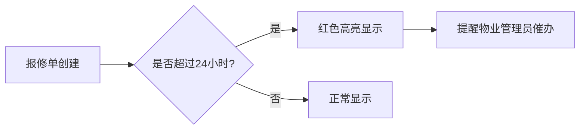

## 1. 产品概述

小区物业公共设施报修管理系统，解决小区公共设施报修流程繁琐、跟踪困难的问题。通过扫码报修、在线派单、状态跟踪和数据统计，实现报修流程数字化管理。

- **目标用户**：小区业主、保安、物业管理员、维修师傅
- **核心价值**：简化报修流程、提高维修效率、透明化管理、数据驱动决策

## 2. 核心功能

### 2.1 用户角色

| 角色 | 注册方式 | 核心权限 |
|------|---------|----------|
| 业主/保安 | 无需登录，扫码即可报修 | 提交报修单、上传故障照片 |
| 物业管理员 | 账号登录 | 查看所有报修单、派单给维修师傅、查看统计数据、管理设施和师傅 |
| 维修师傅 | 账号登录 | 查看分配给自己的报修单、上传维修完成照片、标记已修好 |

### 2.2 功能模块

1. **扫码报修页**：选择故障类型、描述问题、上传照片、提交报修
2. **报修单列表页**：查看所有报修单、筛选状态、派单操作、超时高亮
3. **设施管理页**：添加/编辑设施信息、生成二维码、查看设施报修统计
4. **统计分析页**：设施报修排行、维修师傅效率排行、状态分布图表
5. **维修师傅工作台**：查看待处理工单、标记完成、上传修好照片

### 2.3 页面详情

| 页面名称 | 模块名称 | 功能描述 |
|---------|---------|----------|
| 扫码报修页 | 故障信息表单 | 设施信息展示、故障类型选择、问题描述、照片上传、提交按钮 |
| 报修单列表 | 列表筛选区 | 按状态筛选、按设施筛选、按时间筛选、搜索功能 |
| 报修单列表 | 报修单卡片 | 显示设施名称、故障描述、状态标签、报修时间、超时红色高亮、派单按钮 |
| 设施管理页 | 设施列表 | 设施卡片展示、二维码预览、新增/编辑设施、查看报修次数 |
| 统计分析页 | 设施报修排行 | 柱状图展示报修最多的设施Top10 |
| 统计分析页 | 维修效率排行 | 柱状图展示平均修复时间最短的师傅Top10 |
| 统计分析页 | 状态分布 | 饼图展示各状态报修单占比 |
| 维修工作台 | 我的工单 | 待处理/已完成工单列表、标记完成操作 |

## 3. 核心流程

## 4. 用户界面设计

### 4.1 设计风格

- **主色调**：深蓝色 (#1e40af) - 代表专业、可信赖
- **辅助色**：橙色 (#f97316) - 用于警告、待处理状态；红色 (#dc2626) - 用于超时高亮；绿色 (#16a34a) - 用于已完成状态
- **中性色**：灰色系 (#f8fafc, #e2e8f0, #64748b, #1e293b)
- **按钮风格**：圆角8px，悬停有阴影和颜色加深效果
- **字体**：标题使用 "Noto Sans SC" 600，正文使用 "Noto Sans SC" 400
- **布局风格**：卡片式布局，顶部导航栏，侧边菜单
- **图标**：使用 lucide-react 线性图标

### 4.2 页面设计概述

| 页面名称 | 模块名称 | UI 元素 |
|---------|---------|---------|
| 扫码报修页 | 表单区 | 大标题设施名称、故障类型选择器、文本域、图片上传区、蓝色提交按钮 |
| 报修单列表 | 卡片列表 | 白色卡片、状态标签（带颜色）、时间戳、头像、操作按钮组 |
| 统计分析页 | 图表区 | 彩色柱状图、饼图、数据卡片、渐变背景 |
| 设施管理页 | 设施卡片 | 设施图标、二维码预览角标、报修次数徽章 |

### 4.3 响应式设计

- **桌面优先**：默认1280px以上宽度设计
- **平板适配**：1024px时侧边栏收起，内容区两列布局
- **手机适配**：768px以下单列布局，底部导航栏，表单元素全屏宽度
- **触摸优化**：按钮最小高度44px，手势滑动支持

### 4.4 微交互动效

- 页面加载：元素渐入 + 向上位移，stagger 延迟效果
- 卡片悬停：轻微上浮 + 阴影加深
- 按钮点击：缩放 0.98 + 波纹效果
- 状态变更：颜色渐变过渡
- 超时高亮：呼吸灯动画效果
