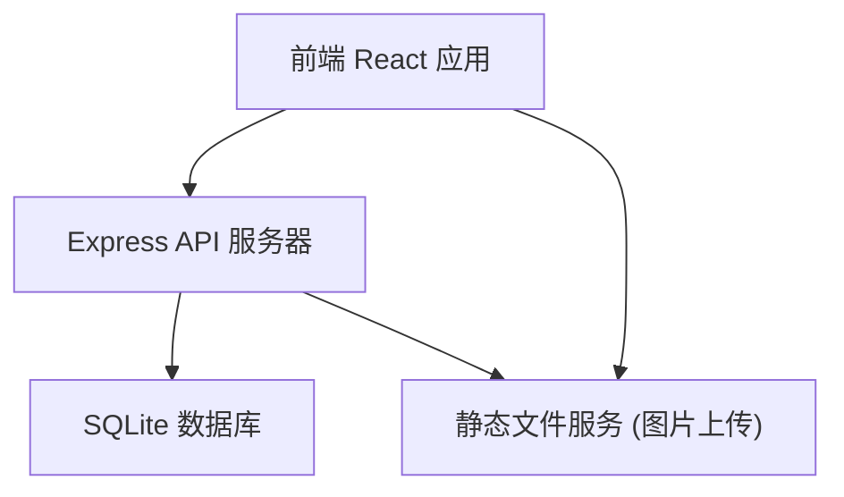
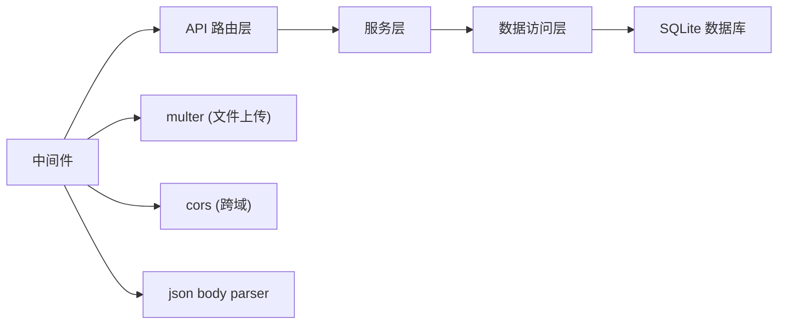
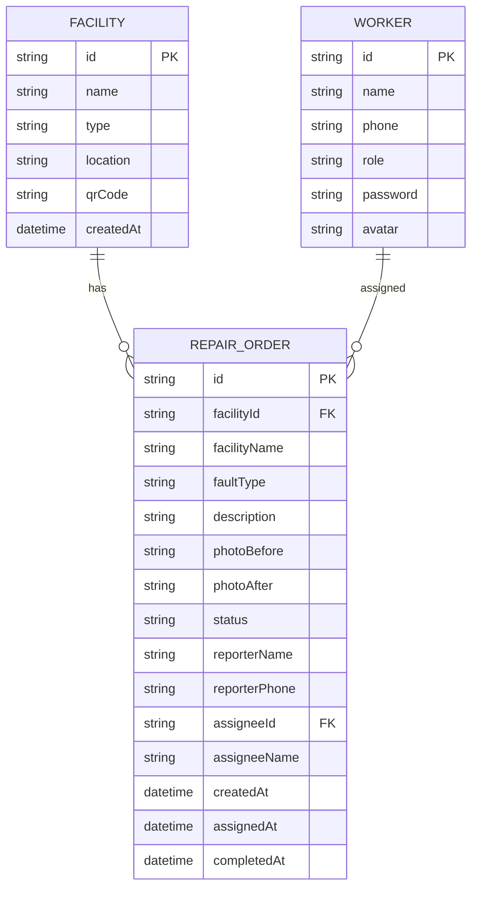

## 1. 架构设计



## 2. 技术栈描述

- **前端**：React@18 + TypeScript + Vite + Tailwind CSS@3 + React Router DOM + Zustand + Recharts + lucide-react
- **后端**：Express@4 + TypeScript
- **数据库**：SQLite3 + better-sqlite3
- **初始化工具**：vite-init react-express-ts 模板
- **文件上传**：multer 中间件，本地存储
- **二维码**：qrcode.react 生成二维码

## 3. 路由定义

| 路由 | 页面 | 权限 |
|------|------|------|
| `/` | 报修单列表（首页） | 管理员/师傅 |
| `/report/:facilityId` | 扫码报修页 | 公开 |
| `/facilities` | 设施管理 | 管理员 |
| `/statistics` | 统计分析 | 管理员 |
| `/workbench` | 维修工作台 | 维修师傅 |
| `/login` | 登录页 | 公开 |

## 4. API 定义

```typescript
// 类型定义
interface Facility {
  id: string;
  name: string;
  type: 'elevator' | 'streetlight' | 'fitness' | 'access' | 'other';
  location: string;
  qrCode: string;
  createdAt: string;
}

interface RepairOrder {
  id: string;
  facilityId: string;
  facilityName: string;
  faultType: string;
  description: string;
  photoBefore: string;
  photoAfter?: string;
  status: 'pending' | 'assigned' | 'repairing' | 'completed';
  reporterName?: string;
  reporterPhone?: string;
  assigneeId?: string;
  assigneeName?: string;
  createdAt: string;
  assignedAt?: string;
  completedAt?: string;
}

interface Worker {
  id: string;
  name: string;
  phone: string;
  role: 'admin' | 'worker';
  avatar?: string;
}

interface Statistics {
  facilityRanking: { facilityId: string; facilityName: string; count: number }[];
  workerEfficiency: { workerId: string; workerName: string; avgRepairHours: number; completedCount: number }[];
  statusDistribution: { status: string; count: number }[];
}

// API Endpoints
// GET    /api/facilities              - 获取设施列表
// POST   /api/facilities              - 创建设施
// PUT    /api/facilities/:id          - 更新设施
// DELETE /api/facilities/:id          - 删除设施

// GET    /api/repair-orders           - 获取报修单列表
// GET    /api/repair-orders/:id       - 获取报修单详情
// POST   /api/repair-orders           - 创建报修单
// PUT    /api/repair-orders/:id       - 更新报修单（派单、完成等）
// PUT    /api/repair-orders/:id/complete - 标记完成并上传照片

// GET    /api/workers                 - 获取维修师傅列表
// POST   /api/workers                 - 创建维修师傅

// GET    /api/statistics              - 获取统计数据

// POST   /api/upload                  - 图片上传
```

## 5. 服务器架构



## 6. 数据模型

### 6.1 ER 图



### 6.2 DDL 语句

```sql
-- 设施表
CREATE TABLE facilities (
  id TEXT PRIMARY KEY,
  name TEXT NOT NULL,
  type TEXT NOT NULL CHECK(type IN ('elevator', 'streetlight', 'fitness', 'access', 'other')),
  location TEXT NOT NULL,
  qr_code TEXT,
  created_at DATETIME DEFAULT CURRENT_TIMESTAMP
);

-- 报修单表
CREATE TABLE repair_orders (
  id TEXT PRIMARY KEY,
  facility_id TEXT NOT NULL,
  facility_name TEXT NOT NULL,
  fault_type TEXT NOT NULL,
  description TEXT,
  photo_before TEXT,
  photo_after TEXT,
  status TEXT NOT NULL DEFAULT 'pending' CHECK(status IN ('pending', 'assigned', 'repairing', 'completed')),
  reporter_name TEXT,
  reporter_phone TEXT,
  assignee_id TEXT,
  assignee_name TEXT,
  created_at DATETIME DEFAULT CURRENT_TIMESTAMP,
  assigned_at DATETIME,
  completed_at DATETIME,
  FOREIGN KEY (facility_id) REFERENCES facilities(id),
  FOREIGN KEY (assignee_id) REFERENCES workers(id)
);

-- 工作人员表
CREATE TABLE workers (
  id TEXT PRIMARY KEY,
  name TEXT NOT NULL,
  phone TEXT NOT NULL UNIQUE,
  role TEXT NOT NULL DEFAULT 'worker' CHECK(role IN ('admin', 'worker')),
  password TEXT NOT NULL,
  avatar TEXT,
  created_at DATETIME DEFAULT CURRENT_TIMESTAMP
);

-- 索引
CREATE INDEX idx_repair_orders_status ON repair_orders(status);
CREATE INDEX idx_repair_orders_facility ON repair_orders(facility_id);
CREATE INDEX idx_repair_orders_assignee ON repair_orders(assignee_id);
CREATE INDEX idx_repair_orders_created ON repair_orders(created_at);
```

### 6.3 初始数据

```sql
-- 默认管理员账号 (密码: admin123)
INSERT INTO workers (id, name, phone, role, password) VALUES 
('admin_001', '系统管理员', '13800138000', 'admin', '$2a$10$...');

-- 默认维修师傅
INSERT INTO workers (id, name, phone, role, password) VALUES 
('worker_001', '张师傅', '13800138001', 'worker', '$2a$10$...'),
('worker_002', '李师傅', '13800138002', 'worker', '$2a$10$...');

-- 默认设施
INSERT INTO facilities (id, name, type, location) VALUES 
('fac_001', '1号楼电梯', 'elevator', '1号楼单元门'),
('fac_002', '2号楼电梯', 'elevator', '2号楼单元门'),
('fac_003', '北门路灯A01', 'streetlight', '小区北门主干道'),
('fac_004', '健身器材-单杠', 'fitness', '中心花园健身区'),
('fac_005', '东门门禁', 'access', '小区东门');
```
